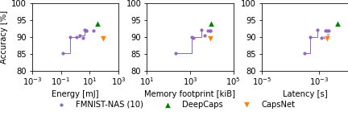
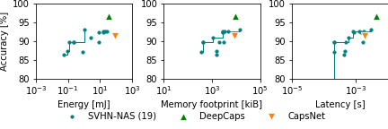
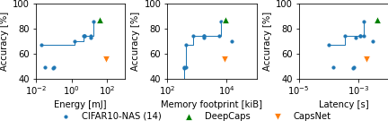

# Best found solutions

We also provide the chromosomes of the best found solutions. You can use them in the evaluation script to compare with our paper.

## MNIST

| Chromosome                            |   Accuracy |     Energy |     Latency |   Memory |
|:---------------------------------|--------:|-----------:|------------:|------------:|
| [NASCaps-MNIST-fbd](ns-fmnist/fbd3f240985f11eaabf82f2cceb7e5c2.chr) |  99.42  | 248.50 mJ | 4.55 ms   | 20,770 KiB |
| [NASCaps-MNIST-b37](ns-fmnist/b378ac4a986c11ea845065b6242fb5c6.chr) |  99.34  | 239.91 mJ | 5.90 ms   | 16,846 KiB |
| [NASCaps-MNIST-1bf](ns-fmnist/1bfe1c90985011ea845065b6242fb5c6.chr) |  99.33  | 32.39 mJ  | 3.03 ms   | 9,471 KiB  |
| [NASCaps-MNIST-f5f](ns-fmnist/f5fb69f8986311ea845065b6242fb5c6.chr) |  99.31  | 41.28 mJ  | 4.10 ms   | 7,502 KiB  |
| [NASCaps-MNIST-04a](ns-fmnist/04a09f4e985711ea845065b6242fb5c6.chr) |  99.21  | 24.77 mJ  | 2.22 ms   | 7,884 KiB  |
| [DeepCaps](chrom_deepcaps.chr)                                      |  99.20  | 36.30 mJ  | 4.29 ms   | 9,051 KiB  |
| [NASCaps-MNIST-a30](ns-fmnist/a30be7fe984a11ea845065b6242fb5c6.chr) |  98.93  | 20.37 mJ  | 1.91 ms   | 7,018 KiB  |
| [NASCaps-MNIST-334](ns-fmnist/334e05d0982911eaabf82f2cceb7e5c2.chr) |  98.90  | 18.72 mJ  | 1.60 ms   | 6,625 KiB  |
| [NASCaps-MNIST-903](ns-fmnist/9031c926983311eaabf82f2cceb7e5c2.chr) |  98.66  | 9.95 mJ   | 0.96 ms   | 4,613 KiB  |
| [CapsNet](chrom_capsnet.chr)                                        |  98.60  | 88.80 mJ  | 1.82 ms   | 8,572 KiB  |
| [NASCaps-MNIST-5da](ns-fmnist/5da20ea0982711eaabf82f2cceb7e5c2.chr) |  98.57  | 3.11 mJ   | 1.09 ms   | 3,061 KiB  |
| [NASCaps-MNIST-cf9](ns-fmnist/cf9327ca983511eaabf82f2cceb7e5c2.chr) |  98.49  | 1.41 mJ   | 0.60 ms   | 988 KiB    |
| [NASCaps-MNIST-a67](ns-fmnist/a6709faa985b11eaabf82f2cceb7e5c2.chr) |  98.48  | 1.08 mJ   | 0.51 ms   | 1,121 KiB  |
| [NASCaps-MNIST-0f6](ns-fmnist/0f6e07b8984311eaabf82f2cceb7e5c2.chr) |  98.30  | 0.52 mJ   | 1.69 ms   | 8,554 KiB  |
| [NASCaps-MNIST-618](ns-fmnist/61840310986411eaabf82f2cceb7e5c2.chr) |  98.26  | 0.08 mJ   | 0.30 ms   | 1,073 KiB  |
| [NASCaps-MNIST-453](ns-fmnist/453c3852982e11eaabf82f2cceb7e5c2.chr) |  98.08  | 1.33 mJ   | 0.57 ms   | 645 KiB    |
| [NASCaps-MNIST-6fb](ns-fmnist/6fb31dd4983e11eaabf82f2cceb7e5c2.chr) |  97.69  | 0.32 mJ   | 0.12 ms   | 206 KiB    |
| [NASCaps-MNIST-b37](ns-fmnist/b37a34fe982e11eaabf82f2cceb7e5c2.chr) |  97.00  | 0.01 mJ   | 0.04 ms   | 99 KiB     |
| [NASCaps-MNIST-a94](ns-fmnist/a949e74a983d11eaabf82f2cceb7e5c2.chr) |  96.99  | 0.01 mJ   | 0.03 ms   | 100 KiB    |
| [NASCaps-MNIST-f1a](ns-fmnist/f1aee00e985511eaabf82f2cceb7e5c2.chr) |  96.84  | 0.00 mJ   | 0.03 ms   | 99 KiB     |
| [NASCaps-MNIST-66b](ns-fmnist/66bd47ca984f11ea845065b6242fb5c6.chr) |  94.55  | 0.25 mJ   | 0.08 ms   | 82 KiB     |
| [NASCaps-MNIST-f8c](ns-fmnist/f8c4ae90982e11eaabf82f2cceb7e5c2.chr) |  93.09  | 0.02 mJ   | 0.13 ms   | 71 KiB     |

## FMNIST

| Chromosome                            |   Accuracy |     Energy |     Latency |   Memory |
|:---------------------------------|--------:|-----------:|------------:|------------:|
| [DeepCaps](chrom_deepcaps.chr)                                       |  90.11  | 36.30 mJ | 4.29 ms   | 9,052 KiB   |
| [NASCaps-FMNIST-aed](ns-fmnist/aed45b709aca11ea8eaa9fe3b11629b2.chr) |  88.94  | 5.60 mJ  | 1.92 ms   | 8,776 KiB   |
| [NASCaps-FMNIST-44f](ns-fmnist/44fc1d889aa611ea8eaa9fe3b11629b2.chr) |  87.85  | 5.53 mJ  | 2.17 ms   | 8,740 KiB   |
| [NASCaps-FMNIST-d9c](ns-fmnist/d9c2e89e9a9b11ea8eaa9fe3b11629b2.chr) |  87.84  | 18.71 mJ | 1.61 ms   | 6,706 KiB   |
| [NASCaps-FMNIST-796](ns-fmnist/796272fe9aa911ea8eaa9fe3b11629b2.chr) |  87.79  | 6.58 mJ  | 2.61 ms   | 8,719 KiB   |
| [NASCaps-FMNIST-10a](ns-fmnist/10ae364e9aa911ea8eaa9fe3b11629b2.chr) |  87.75  | 4.20 mJ  | 0.88 ms   | 3,345 KiB   |
| [NASCaps-FMNIST-926](ns-fmnist/926ad3e69acb11ea8eaa9fe3b11629b2.chr) |  87.49  | 1.24 mJ  | 1.56 ms   | 7,873 KiB   |
| [NASCaps-FMNIST-d05](ns-fmnist/d05ba24e9ab611ea8eaa9fe3b11629b2.chr) |  87.30  | 2.02 mJ  | 2.02 ms   | 4,591 KiB   |
| [NASCaps-FMNIST-d4d](ns-fmnist/d4d179209ab111ea8eaa9fe3b11629b2.chr) |  87.26  | 3.29 mJ  | 1.20 ms   | 1,389 KiB   |
| [NASCaps-FMNIST-320](ns-fmnist/320c46389ac111ea8eaa9fe3b11629b2.chr) |  87.19  | 0.41 mJ  | 0.47 ms   | 1,148 KiB   |
| [CapsNet](chrom_capsnet.chr)                                         |  86.17  | 88.80 mJ | 1.82 ms   | 8,573 KiB   |
| [NASCaps-FMNIST-d96](ns-fmnist/d96b451c9acd11ea8eaa9fe3b11629b2.chr) |  81.87  | 0.13 mJ  | 0.30 ms   | 209 KiB     |

## SVHN

| Chromosome                            |   Accuracy |     Energy |     Latency |   Memory |
|:---------------------------------|--------:|-----------:|------------:|------------:|
| [[DeepCaps](chrom_deepcaps.chr)                                    |  96.10  | 36.30 mJ | 4.29 ms   | 9,051 KiB  |
| [NASCaps-SVHN-9df](ns-fmnist/9df45e9e9d1411eabceca98e270e91ea.chr) |  94.93  | 26.44 mJ | 2.69 ms   | 7,439 KiB  |
| [NASCaps-SVHN-ff4](ns-fmnist/ff4beef49d1f11eabceca98e270e91ea.chr) |  94.37  | 19.72 mJ | 1.81 ms   | 7,010 KiB  |
| [NASCaps-SVHN-e95](ns-fmnist/e95f08309cff11eabceca98e270e91ea.chr) |  94.25  | 18.96 mJ | 1.59 ms   | 6,470 KiB  |
| [NASCaps-SVHN-022](ns-fmnist/022c9a309d6411eabceca98e270e91ea.chr) |  90.69  | 20.97 mJ | 1.31 ms   | 4,727 KiB  |
| [NASCaps-SVHN-3ca](ns-fmnist/3cac07bc9d5111eabceca98e270e91ea.chr) |  90.52  | 25.20 mJ | 1.73 ms   | 3,375 KiB  |
| [NASCaps-SVHN-2a6](ns-fmnist/2a65a7ba9cdf11eabceca98e270e91ea.chr) |  90.49  | 1.07 mJ  | 3.02 ms   | 14,465 KiB |
| [NASCaps-SVHN-33c](ns-fmnist/33ce4e0c9d9211eabceca98e270e91ea.chr) |  90.43  | 16.73 mJ | 0.88 ms   | 2,860 KiB  |
| [NASCaps-SVHN-ba3](ns-fmnist/ba3ad0869d0211eabceca98e270e91ea.chr) |  90.37  | 8.53 mJ  | 1.62 ms   | 2,965 KiB  |
| [NASCaps-SVHN-7b2](ns-fmnist/7b2197a89d0d11eabceca98e270e91ea.chr) |  90.14  | 8.08 mJ  | 1.45 ms   | 2,787 KiB  |
| [NASCaps-SVHN-0e1](ns-fmnist/0e1ab2169d6711eabceca98e270e91ea.chr) |  90.08  | 16.65 mJ | 0.83 ms   | 2,784 KiB  |
| [NASCaps-SVHN-b34](ns-fmnist/b34499d69d4f11eabceca98e270e91ea.chr) |  89.32  | 2.56 mJ  | 0.60 ms   | 1,086 KiB  |
| [CapsNet](chrom_capsnet.chr)                                       |  88.30  | 88.80 mJ | 1.82 ms   | 8,572 KiB  |
| [NASCaps-SVHN-431](ns-fmnist/4317a56c9d3211eabceca98e270e91ea.chr) |  88.30  | 0.24 mJ  | 0.21 ms   | 441 KiB    |
| [NASCaps-SVHN-812](ns-fmnist/8123edc09d8711eabceca98e270e91ea.chr) |  86.89  | 0.24 mJ  | 0.21 ms   | 435 KiB    |
| [NASCaps-SVHN-53b](ns-fmnist/53bec1da9d9511eabceca98e270e91ea.chr) |  86.74  | 0.12 mJ  | 0.47 ms   | 2,033 KiB  |
| [NASCaps-SVHN-257](ns-fmnist/257275a69d4011eabceca98e270e91ea.chr) |  85.74  | 0.09 mJ  | 0.45 ms   | 1,483 KiB  |
| [NASCaps-SVHN-a20](ns-fmnist/a203ecd29d3e11eabceca98e270e91ea.chr) |  83.87  | 0.13 mJ  | 0.18 ms   | 379 KiB    |
| [NASCaps-SVHN-213](ns-fmnist/21359d269d7f11eabceca98e270e91ea.chr) |  83.14  | 0.05 mJ  | 0.41 ms   | 1,482 KiB  |
| [NASCaps-SVHN-aaa](ns-fmnist/aaa14d9a9d4c11eabceca98e270e91ea.chr) |  83.04  | 0.78 mJ  | 0.21 ms   | 368 KiB    |
| [NASCaps-SVHN-4f6](ns-fmnist/4f659b9c9d4311eabceca98e270e91ea.chr) |  75.02  | 0.13 mJ  | 0.73 ms   | 521 KiB    |

## CIFAR-10

| Chromosome                            |   Accuracy |     Energy |     Latency |   Memory |
|:---------------------------------|--------:|-----------:|------------:|------------:|
| [DeepCaps](chrom_deepcaps.chr)                                      |   87.10  | 36.30 mJ | 4.28 ms |    9051 KiB |
| [NASCaps-C10-f1e](ns-cifar10/f1eca592989111ea8d92d90c930a8e35.chr) |   85.99 | 17.38 mJ | 1.52 ms |    6,319 KiB |
| [NASCaps-C10-a0d](ns-cifar10/a0dd17aa984f11ea8d92d90c930a8e35.chr) |   74.11 |  4.52 mJ | 1.11 ms |    1,718 KiB |
| [NASCaps-C10-9fd](ns-cifar10/9fd9056c98db11ea8d92d90c930a8e35.chr) |   74.00 |  5.10 mJ | 0.36 ms |      712 KiB |
| [NASCaps-C10-658](ns-cifar10/658bdbcc988711ea8d92d90c930a8e35.chr) |   73.91 |  5.06 mJ | 1.53 ms |    5,572 KiB |
| [NASCaps-C10-458](ns-cifar10/458b8f4c98bf11ea8d92d90c930a8e35.chr) |   73.82 | 11.57 mJ | 1.12 ms |    1,740 KiB |
| [NASCaps-C10-51d](ns-cifar10/51d1fdf698ae11ea8d92d90c930a8e35.chr) |   73.03 | 11.98 mJ | 0.80 ms |    1,747 KiB |
| [NASCaps-C10-9c9](ns-cifar10/9c952c3a98d811ea8d92d90c930a8e35.chr) |   69.50 |  1.40 mJ | 2.97 ms |   1,4578 KiB |
| [NASCaps-C10-6c2](ns-cifar10/6c23d85e98a511ea8d92d90c930a8e35.chr) |   67.15 |  0.02 mJ | 0.10 ms |     422 KiB |
| [CapsNet](chrom_capsnet.chr)                                       |   55.85 | 88.80 mJ | 1.82 ms |    8,572 KiB |
| [NASCaps-C10-e03](ns-cifar10/e034421498a611ea8d92d90c930a8e35.chr) |   49.32 |  0.09 mJ | 0.69 ms |     360 KiB |
| [NASCaps-C10-f89](ns-cifar10/f895c07c988211ea8d92d90c930a8e35.chr) |   49.19 |  0.03 mJ | 0.14 ms |     422 KiB |
| [NASCaps-C10-579](ns-cifar10/5799c160986d11ea8d92d90c930a8e35.chr) |   48.35 |  0.09 mJ | 0.65 ms |     360 KiB |
| [NASCaps-C10-02c](ns-cifar10/02c0590a985f11ea8d92d90c930a8e35.chr) |   10.02 | 15.11 mJ | 1.32 ms |    1,779 KiB |
| [NASCaps-C10-fe9](ns-cifar10/fe90579e987d11ea8d92d90c930a8e35.chr) |   10.00 |  0.08 mJ | 0.65 ms |     360 KiB |
| [NASCaps-C10-eb4](ns-cifar10/eb4c8902988511ea8d92d90c930a8e35.chr) |   10.00 |  4.96 mJ | 0.80 ms |    1,730 KiB |
